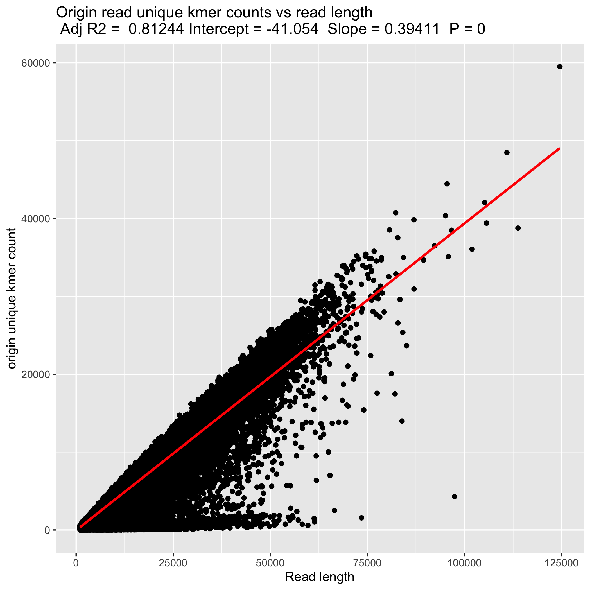

# Uniq-mer Analysis
This folder contains the scripts used to analyze the existence and the distribution of unique kmers in nanopore reads

# Read length versus Uniq-mer count
Refer to folder `read_length`

What is the association between read length and the number of uniq-mers? Compare non-erroneous reads versus nanopore reads?

# Spacing of uniq-mers
Refer to folder `spacing`

How far apart are these uniq-mer regions?

# False and lost Uniq-mers
Refer to folder `false_uniqmer `

How many uniq-mers do nanopore reads lose and how many to they gain?

## Uniq-mer loss
This plot compares how many uniq-mers are in the simulated nanopore read versus the region from which it came from

## False Uniq-mer rates
This plot shows the frequency of erroneous uniq-mers in simulated nanopore reads

