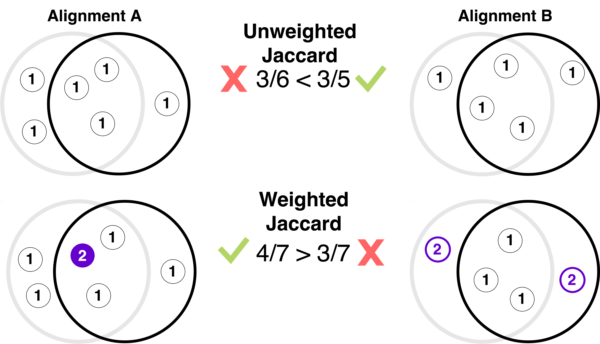
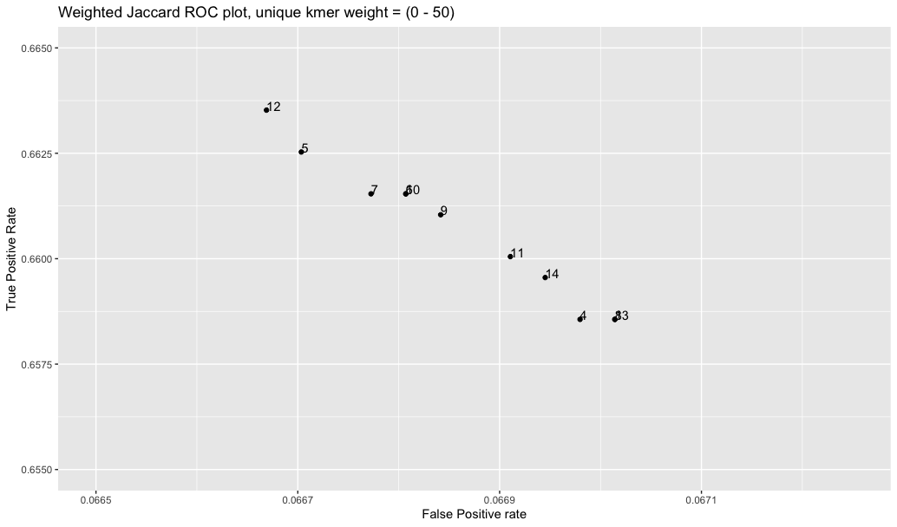
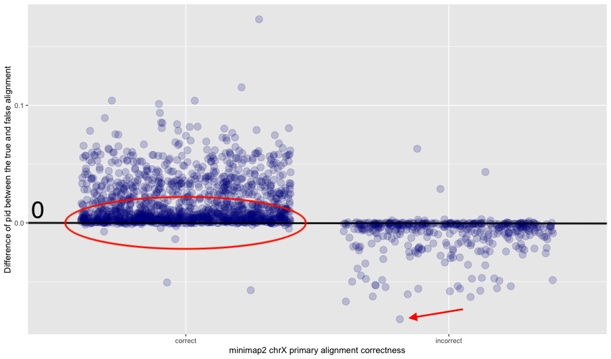
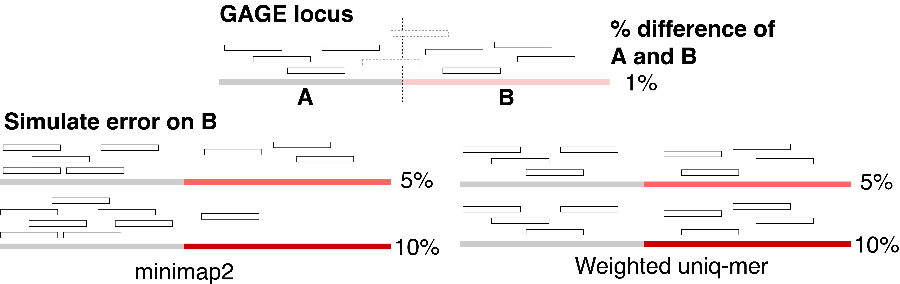
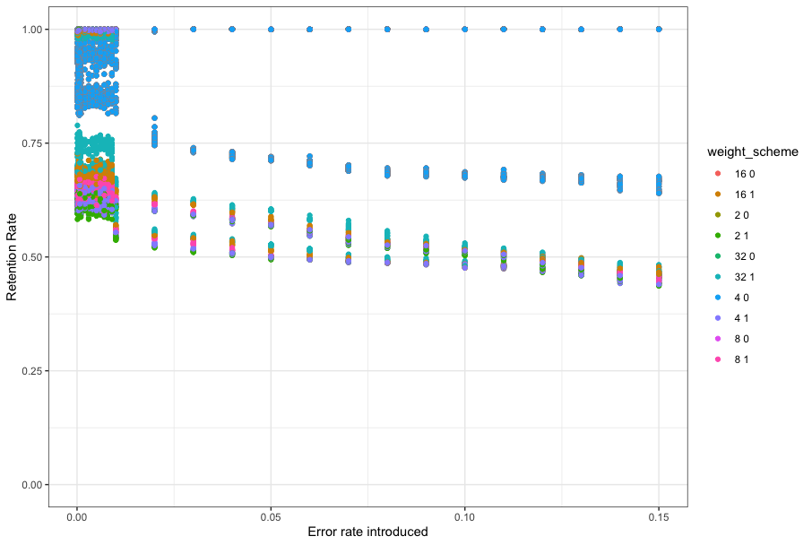

# Weighted Jaccard Testing
This collection of scripts calculates and evaluates the performance of a weighted Jaccard Scheme to select the correct alignment.

# Dependencies
- canu
- bedtools
- minimap2 or mashmap
- samtools

# Using an existing reference
This section consists of the following steps:
1. Parsing an alignment file (BAM or mashmap output)
2. Evaluating mapper
3. Evaluating performance of multiple weighting schemes
4. Comparing performance

## Ground Truth
To determine if an alignment is true, we treat the alignment of the non-errored version of a simulated read as the Ground Truth, and as long as the simulated read aligns such that it covers at least 50% of the original alignment, this counts as true

## Counting k-mers

## Scheme Scoring

 - **Plots** : Plot of the performance of each weight, labeled on each point 
 

## Percent Identity Effects
To see the potential effects of variable percent identity between a read and multiple candidate alignments, I calculate the percent ID for each alignment. Then for each mapping method, I compared the percent ID between the mapper's "primary" alignment and the true alignment (if said primary alignment was false), or the second best alignment (if the primary alignment was already true to begin with) 

Optional, but you can just analyze reads with multiple alignments. Refer to the **Format** folder for more info. 

## Simulation on the GAGE locus
To test the effects of variable error rates, we simulated random error in one half of the GAGE locus, and then realigned simulated reads back onto this new GAGE locus.

